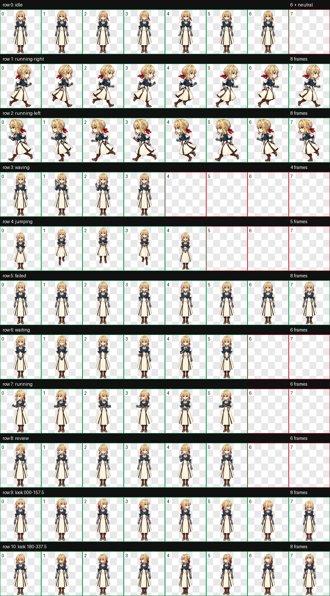
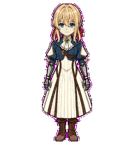
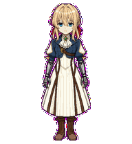
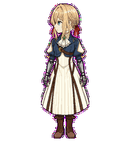

# 薇尔莉特·伊芙加登 Codex Pet / Violet Evergarden Codex Pet

以薇尔莉特·伊芙加登为原型的端庄、克制的 Q 版像素动画宠物。

*A poised and restrained chibi pixel-art animated pet modeled after Violet Evergarden.*



## 安装 / Installation

下载或克隆本仓库，将仓库根目录中的以下两个文件放入同一个 Codex 宠物目录：

Download or clone this repository, then place the following two files from the repository root in the same Codex pet directory:

```text
violet-evergarden/
├── pet.json
└── spritesheet.webp
```

默认目录：

Default directories:

- Windows：`%USERPROFILE%\.codex\pets\violet-evergarden\`
- macOS / Linux：`${CODEX_HOME:-$HOME/.codex}/pets/violet-evergarden/`

`extras/`、`docs/` 和 `qa/` 仅用于预览、归档与检查，不是安装所需文件。

The `extras/`, `docs/`, and `qa/` directories are used only for previews, archiving, and validation; they are not required for installation.

## 技术规格 / Technical Specifications

| 项目 / Item | 值 / Value |
| --- | --- |
| Pet ID | `violet-evergarden` |
| Sprite contract | Codex v2 |
| `spriteVersionNumber` | `2` |
| 图集尺寸 / Sprite-sheet dimensions | 1536×2288 px |
| 布局 / Layout | 8 列 × 11 行 / 8 columns × 11 rows |
| 单元格 / Cell size | 192×208 px |
| 格式 / Format | 透明 WebP / Transparent WebP |

### 动画行 / Animation Rows

| 行 / Row | 状态 / State | 有效帧 / Valid frames |
| ---: | --- | ---: |
| 0 | idle | 6 |
| 1 | running-right | 8 |
| 2 | running-left | 8 |
| 3 | waving | 4 |
| 4 | jumping | 5 |
| 5 | failed | 8 |
| 6 | waiting | 6 |
| 7 | running | 6 |
| 8 | review | 6 |
| 9 | 视线方向 / look directions: 000–157.5° | 8 |
| 10 | 视线方向 / look directions: 180–337.5° | 8 |

## 动画预览 / Animation Previews

| 状态 / State | 预览 / Preview |
| --- | --- |
| idle |  |
| running-right |  |
| running-left |  |
| waving |  |
| jumping |  |
| failed |  |
| waiting |  |
| running |  |
| review |  |

16 个视线方向的检查图见 [`docs/look-directions.png`](docs/look-directions.png)。

See [`docs/look-directions.png`](docs/look-directions.png) for the validation sheet covering all 16 gaze directions.

## QA 状态 / QA Status

- v2 图集验证通过：尺寸、行列、有效帧和透明格均符合约定。  
  The v2 sprite sheet passed validation: its dimensions, rows and columns, valid frames, and transparent cells all comply with the specification.
- 完全透明像素的 RGB 残留为 0。  
  Fully transparent pixels contain no residual RGB values.
- 最终视觉验收通过，无需返修动画行。  
  The final visual review passed, and no animation rows require rework.
- 四个基准视线方向通过硬性检查；中间方向的保留警告与复核依据收录在 `qa/`。  
  The four reference gaze directions passed strict checks; retained warnings for intermediate directions and the supporting review rationale are documented in `qa/`.
- 主图集约 1.7 MiB，此仓库无需 Git LFS。  
  The main sprite sheet is approximately 1.7 MiB, so this repository does not require Git LFS.

详细报告见 [`qa/README.md`](qa/README.md)。

See [`qa/README.md`](qa/README.md) for the detailed report.

## 附加版本 / Additional Version

[`extras/standard-8x9/`](extras/standard-8x9/) 保存最初要求的 1536×1872、8×9 标准动画图集。它用于归档与其他兼容场景，不应替代仓库根目录的 Codex v2 图集进行安装。

[`extras/standard-8x9/`](extras/standard-8x9/) preserves the originally requested 1536×1872, 8×9 standard animation sprite sheet. It is intended for archiving and other compatible use cases and should not replace the Codex v2 sprite sheet in the repository root during installation.

## 权利说明 / Rights Notice

这是非官方角色衍生宠物项目。仓库不包含制作时使用的原始参考图；公开发布或再分发前请阅读 [`NOTICE.md`](NOTICE.md)。

This is an unofficial character-derived pet project. The repository does not include the original reference images used during production. Please read [`NOTICE.md`](NOTICE.md) before publishing or redistributing the project.
